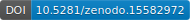

# Unlocking sea turtle diving behaviour from low-temporal resolution time-depth recorders - R Code

This repository provides the R code used in the following research paper:

Jessica Harvey-Carroll, Javier Menéndez-Blázquez, Jose Luis Crespo-Picazo, Ricardo Sagarminaga and David March (2025). Unlocking sea turtle diving behaviour from low-temporal resolution time-depth recorders, *Scientific reports.*

------------------------------------------------------------------------

## Get started

-   Edit `config.R` with your computer parameters
-   Folder `/fun` contains custom functions
-   Folder `/R` contains R scripts, which are organized by processing workflow

## Processing workflow

1.  Porcessing tracking data (individual level)

-   1.1. Preprocessing
-   1.2. Filtering
-   1.3. State-space-model (SSM)

2.  Processing TTDR data (individual level)

-   2.1. QC of depth and temperature
-   2.2. Zero-offset correction
-   2.3. Dive segmentation
-   2.4. Validation of segmentation with 1-minute data (Supplementary)
-   2.5. Diving metrics
-   2.6. Incorporate sensor data: SSM and SST

3.  Diving behaviour (all turtles)

-   3.1. Hidden-markov model

## Tables

1.  Metadata table

## Figures

1.  Map with tracking data, color coded with SSM behaviour
2.  Segmentation method
3.  Diving profiles by state
4.  Diving behaviour budgets per turtle
